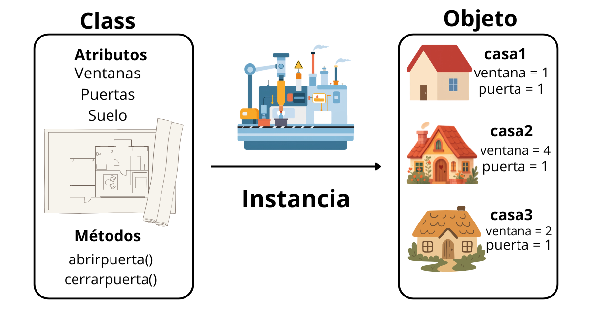
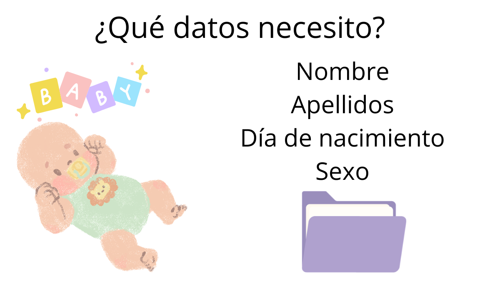
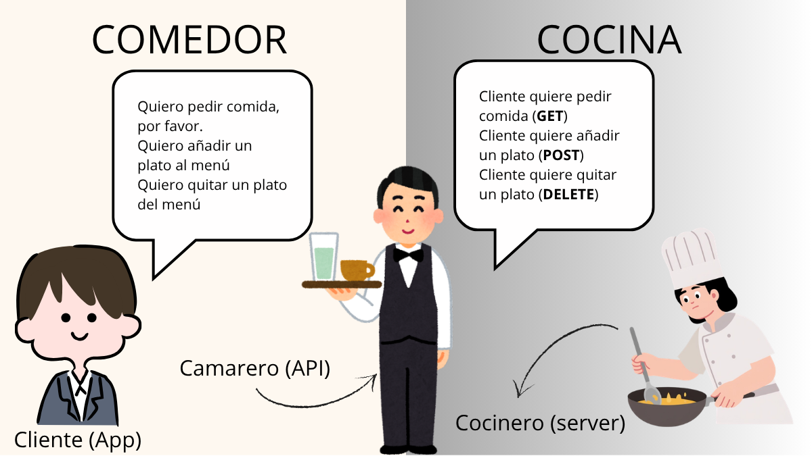
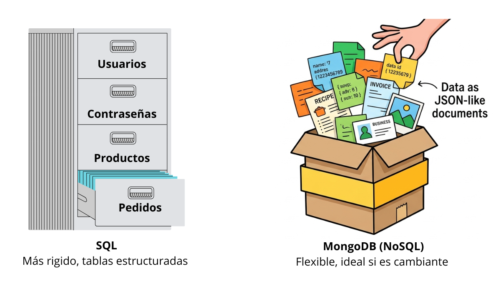
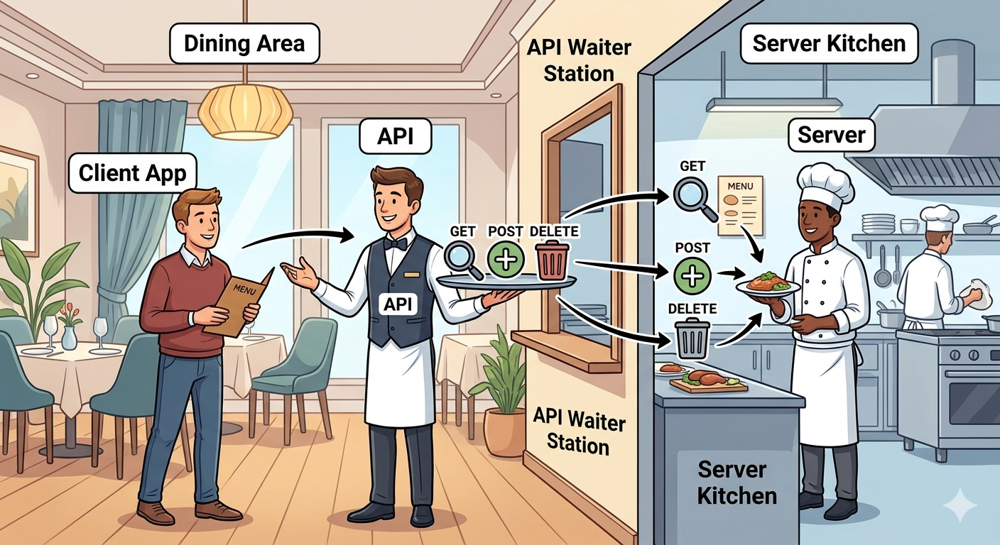
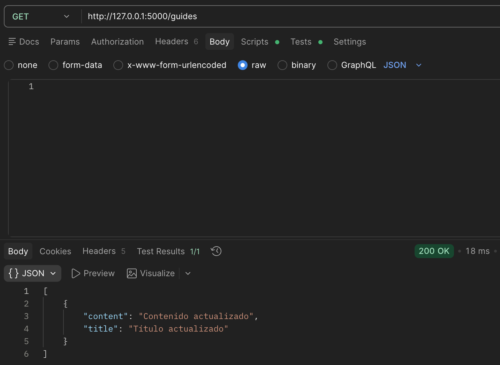
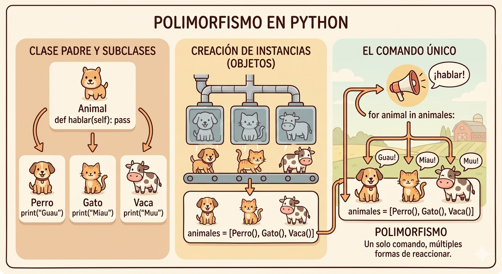
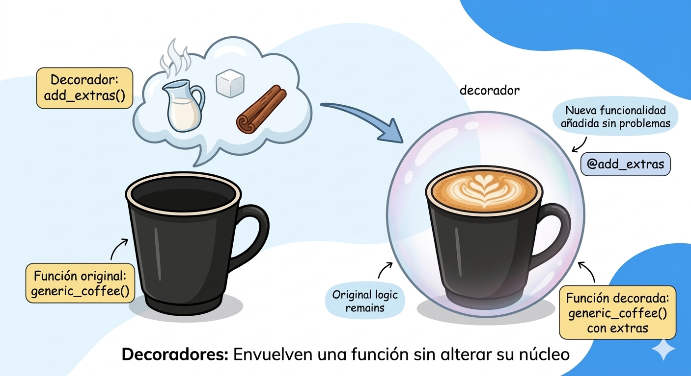

# CONCEPTOS DE PYTHON OOP

## ¿Para qué usamos Clases en Python?

Una Clase en Python es como una "receta" o "plano" para crear objetos con las mismas características.

Por ejemplo, si pensamos en una receta, en ella tenemos los ingredientes necesarios y los pasos necesarios para cocinar un plato.
La Clase funciona de la misma manera, es la plantilla que nos va a indicar las características (`atributos`) que necesitamos (los ingredientes de nuestra receta) y los comportamientos (`métodos`) que tendrá un objeto (las instrucciones para cocinar).
El resultado final, es decir, el plato cocinado, sería el `objeto`.

Por ejemplo, si pensamos en un plano o proyecto para crear una casa, una Clase sería el plano donde tienes guardados cómo va a ser el suelo, las paredes, las ventanas... es donde tenemos todo anotado. Luego con esa información es cuando vamos a poder crear la casa.
La casa es el objeto.



Las Clases se usan principalmente en la *Programación Orientada a Objetos (POO)*, lo que nos permite organizar el código de forma más lógica y estructurada.

Con las Clases podemos agrupar datos y funciones relacionadas en un solo lugar (encapsular).
Podemos agrupar todas las funciones relativas a una misma clase juntas para poder tener acceso a ellas y tener un código más ordenado, accesible y fácil de mantener.

Las Clases nos permiten reutilizar código de una manera más sencilla, ya que una vez definida una clase, puedes crear tantos objetos como necesites basándote en ella.
Esto se conoce como instanciación.

También existe la herencia, que permite crear nuevas clases a partir de otras, reutilizando sus características y comportamientos.

Gracias a la herencia podemos reutilizar ese "molde" que hemos creado antes y aplicar esos mismos métodos para una clase nueva.

Por ejemplo:

```python
class Animal:
    pass

class Perro(Animal):
    pass
```

Lo que definamos en la clase "principal" (`Animal`) también se va a heredar en la clase de `Perro` pudiendo usar las funciones definidas en la clase "principal" sin tener que duplicar código.

Por convención, los nombres de las clases se escriben en mayúscula inicial, es lo que está considerado una buena practica.

En resumen, las clases nos permiten organizar mejor el código y reutilizarlo en proyectos más grandes.

### Ejemplo

```python
class Usuario: # Aquí estamos creando nuestra clase 
    def __init__(self, nombre): 
        self.nombre = nombre # El ingrediente que guardamos si pensamos como en una receta

    def __str__(self):
        return(f"Hola, soy {self.nombre}")

usuario1 = Usuario("Patricia") #Instancia la clase, estamos creando el objeto, el plato que obtenemos. 
print(usuario1)
```

## ¿Qué método se ejecuta automáticamente cuando se crea una instancia de una clase?

Cuando creamos la instancia de una clase, el primer método que se ejecuta es  `__init__`, comúnmente conocido como el constructor de la clase. Es un método que se va a ejecutar automáticamente sí o sí.

Podemos pensar en el método `__init__` como el momento en el que "nace" el objeto.

El método `__init__` tiene como función principal asignar valores a las propiedades del objeto que vamos a crear, o incluso realizar las operaciones necesarias en el momento de su creación.
Prepara el "terreno" para que el objeto tenga todos sus datos listos desde el primer momento.

Ejemplo visual:


Ejemplo en código:

```python
class Usuario: 
    def __init__(self, nombre, edad): # Preparamos la plantilla 
        self.nombre = nombre
        self.edad = edad

usuario1 = Usuario("Patricia", 34) # Creamos el objeto
# Ahora se ejecuta automáticamente __init__

print(usuario1.nombre)
print(usuario1.edad)
```

Con este ejemplo vemos que en nuestra clase `Usuario` hay dos atributos: `nombre` y `edad`.
Gracias a `__init__`, estos valores se asignan automáticamente al crear el objeto.

Si no utilizásemos el método `__init__`, tendríamos que asignar los atributos manualmente para cada objeto:

```python
class Usuario:
    pass

usuario1 = Usuario()
usuario1.nombre = "Patricia"
usuario1.edad = 34

print(usuario1.nombre)
print(usuario1.edad)
```

Esto hace que el código sea más largo, repetitivo y menos eficiente.

Tenemos que pensar en el método `__init__`como "Cuando se crea algo, ¿qué necesito ponerle desde el principio?".
Por ejemplo, cuando nace una persona y queremos registrarla necesitamos saber su nombre, el dia de nacimiento,etc.



## ¿Cuáles son los tres verbos de API?

Cuando se habla de "los verbos de una API", nos referimos a las acciones que podemos realizar sobre los datos que podemos encontrarnos en una aplicación. Se llaman asi, verbos, porque representan acciones a realizar sobre los datos.

Los más comunes son GET, POST, PUT y DELETE, aunque en muchos casos se destacan solamente GET, POST, y DELETE como base.

Podemos pensar en los verbos y en las APIs como un restaurante.
El cliente (aplicación) pide la comida al camarero (API), este mediante los verbos hace el pedido del cliente a la cocina (servidor). 
Los diferentes pedidos que puede hacer el cliente son, pedir comida (`GET`), añadir un plato nuevo al menu (`POST`) y eliminar un plato del menu (`DELETE`).



### GET (Obtener/Leer) 🔍

El verbo GET nos sirve para obtener información sobre los recursos que tenemos en una base de datos.

Sirve para pedir datos sin cambiar nada. Solo devuelve información que ya existe.

Por ejemplo:

* Ver una lista de usuario
* Cargar tus mensajes
* Hacer una búsqueda en Google

Es el verbo que más se usa.

### POST (Enviar/Crear) ➕

El verbo POST se utiliza para crear un nuevo recurso en una base de datos.

Nos va servir para añadir datos a una base de datos añadiendo un nuevo recurso, no va a modificar nada de lo que ya estaba sino que nos va a crear uno nuevo.

Si queremos modificar un recurso ya existente vamos a necesitar otro verbo, PUT.

Por ejemplo:

* Publicar un comentario en Instagram
* Crear un nuevo usuario
* Publicar una foto

### DELETE (Borrar/Eliminar) 🗑

Tal como nos indica el nombre, nos sirve para eliminar un recurso ya existente en una base de datos.

Por ejemplo:

* Eliminar una cuenta de usuario
* Eliminar un comentario en una foto
* Quitar un producto de la base de datos de una tienda.

## ¿Es MongoDB una base de datos SQL o NoSQL?

Antes de decidir si MongoDB es una base de datos SQL o No SQL tenemos que tener claro que es una base de datos SQL y que no lo es.

Una base de datos SQL es algo como un archivador o un Excel muy estricto.
Tienes tablas o cajones con carpetas muy especificas. Todo esta organizado en filas y columnas y tienen un tipo de información fijo. Es decir, en cada columna tienes un tipo de información fijo, por ejemplo, una columna puede contener los nombres de los usuarios y otra columna los teléfonos, pero no puedes meter una foto de repente porque "no cabe" en el formato especificado.
Una base de datos SQL tiene una estructura fija, si quieres añadir un dato nuevo, por ejemplo, el email de todos los usuarios, tienes que extraer todas las hojas y rediseñar todo el formulario de cada una de ellas. Es muy ordenado pero poco flexible.

Mongo DB es una base de datos NoSQL. Funciona como la caja con sobres donde guardas la información.
Tienes flexibilidad total, en un sobre puedes tener una receta de cocina; en el siguiente, una factura de la luz; y en el tercero, un contacto con su foto y tres números de teléfono. No importa que los datos sean distintos, MongoDB los va a guardar todos sin quejarse.



La información la guarda en documentos tipo JSON, nos pueden recordar a notas o fichas. Al ser tan flexible podemos decidir un dia que ademas los datos que tenemos ahora en esa "ficha" necesitamos añadir más información, lo único que tendríamos que hacer es en el siguiente registro añadirla sin tener que cambiar todo el resto de entradas.

Principales diferencias entre una y la otra:

| SQL | MongoDB/NoSQL |
| :---: | :---: |
| Perfecto para datos que cambian poco | Ideal para datos que cambian constantemente |
| Muy rápido si buscas cosas muy específicas | Muy rápido para manejar volúmenes grandes de datos diferentes |
| Más rígido | Fácil de modificar y actualizar |

Una forma muy fácil de poder ver sus diferencias es ver cuando se utiliza uno y cuando otro.
Las bases de datos SQL se utilizan, por ejemplo, en bancos, tiendas online o aplicaciones con datos muy estructurados. Porque todo esta bien conectado, no podemos meter datos "extraños" y es más seguro cuando queremos una información más precisa y fiable.
Las bases de datos NoSQL, por el contrario, se usan para apps tipo redes sociales, chats o proyectos donde todo cambia constantemente. Ya que no tienes que definir todo desde el principio, puedes añadir campos cuando quieras y están pensadas para ir siendo modificadas constantemente añadiendo nuevas opciones o versiones. Si se necesita modificar cosas rápidamente y de forma eficiente usas una base de datos NoSQL y por lo tanto, MongoDB.

Algo muy importante a recalcar es que MongoDB puede ser algo caótico, es decir, si metemos un dato que anteriormente no teníamos no nos va a avisar, tenemos que ser nosotros los que busquemos si ese dato lo teníamos antes o no y tendríamos que actualizarlo.

Como hemos indicado anteriormente MongoDB es una base de datos NoSQL ya que no nos obliga a utilizar una tabla rígida de filas y columnas, sino que nos permite guardar la información de forma más orgánica, como su estuviésemos utilizando notas adhesivas en una carpeta o guardando la información en sobres.

## ¿Qué es una API?

Una API (Application Programming Interface) es un intermediario que permite que dos aplicaciones hablen entre si.

Vamos a pensar en una API como en el camarero que manda nuestro pedido a la cocina para que luego nos traigan el plato que queremos comer.
Nosotros como clientes no sabemos como funciona la organización o servicio que tienen en el restaurante por lo que el camarero es nuestra conexión con el resultado que queremos obtener.
Una API nos va a hacer ese trabajo, nosotros le pedimos un dato a una API y ella nos da el resultado consultando primero a otro servidor.



Un claro ejemplo de una API puede ser Spotify.
Tu haces una petición, que busque una canción. Entonces la app de Spotify usa una API que pide esos datos al servidor, cuando el servidor responde a esa consulta, la app reproduce la canción que has pedido.

Las APIs son muy importantes ya que te permite acceder a una información sin tener que preocuparte de como hacerlo, sino que ella se encarga de conectar esas dos aplicaciones para ti.

También es importante señalar que una API solo entrega la información necesaria, no te facilita más información que la que has pedido. Es por esto que ayudan a controlar la información que se expone.

Una API define reglas claras, si pides algún dato que no esta en su ordenación, esta te indicara que no es posible procesar esa orden, por lo que también te aseguras de que los datos que te va a facilitar están estandarizados.

Gracias a las APIs podemos crear una app utilizando esas conexiones con otras ya creadas y poder mejorar nuestro servicio sin tener que hacerlo todo desde cero.

## ¿Qué es Postman?

Postman un programa que nos sirve para probar las peticiones que hacemos a una API.
Por simplificarlo, antes de crear la parte visual de una aplicación necesitamos saber si las conexiones que hemos creado funcionan bien.

Por ejemplo, estamos creando una aplicación para ver la temperatura que hay en algunas ciudades.
Con Postman enviamos una petición a nuestra API preguntando cual es la temperatura de Bilbao y le damos a un botón. Ya sabemos que nos ha de responder con la temperatura del lugar, si lo hace ya sabemos que nuestra API funciona correctamente. Sino, tenemos que revisar y corregirlo.

Si no utilizásemos Postman tendríamos que construir toda la aplicación desde cero, ponerle botones, colores, etc y una vez hecho todo probarla.
Si algo falla no podemos saber si es culpa de que hemos puesto mal el botón o que las conexiones que hemos realizado al servidor no funciona.

Con Postman vamos a poder hacer las modificaciones y las pruebas que queramos, ademas de poder controlar la calidad de la aplicación que estamos construyendo.
Además de ellos nos traduce la información, es decir, nos ayuda a ver la información de forma ordenada, como una lista, en lugar de ver códigos extraños (JSON). Gracias a Postman podemos leer los archivos JSON de forma más visual.

Esto nos lleva a lo que hemos hablado antes sobre los verbos de las APIs, con Postman podemos ejecutar esos verbos, podemos ver toda la información (GET), podemos añadir información nueva (POST), asi como borrar los datos que queramos (DELETE) o incluso modificarlos (PUT)

Esto permite detectar errores antes de construir la interfaz gráfica, ahorrando tiempo y facilitando el desarrollo.



## ¿Qué es el polimorfismo?

El polimorfismo, si lo miramos etimológicamente significa Poli (muchos) y morfismo (formas). Sabiendo esto podemos deducir que es la capacidad de que algo tenga muchas formas.

Un ejemplo cotidiano:
Si apuntas a un reproductor de música y presionas "Play", suena la música.
Si apuntas a un reproductor de video y presionas "Play", sale imagen y sonido.


El botón es el mismo para ambos casos y la acción que haces (presionar) también, pero el resultado depende el objeto al que estamos apuntando (Un reproductor de video o de música)

En programación, el polimorfismo es la característica de los objetos que permite implementar un método varias veces con diferente funcionalidad cada vez.

Por ejemplo:

```python
class Animal:
    def hablar(self):
        pass

class Perro(Animal):
    def hablar(self):
        print("Guau")

class Gato(Animal):
    def hablar(self):
        print("Miau")

class Vaca(Animal):
    def hablar(self):
        print("Muu")

animales = [Perro(), Gato(), Vaca()]

for animal in animales:
    animal.hablar()

# Guau
# Miau
# Muu
```

En este ejemplo tenemos una clase padre `Animal` con un método definido pero no implementado, de la que heredan 3 animales. Cada animal implementa el método común a ellos de una manera diferente.
Lo que estamos diciendo es "Para cada animal en mi granja, haz que hable". No necesitamos decirle "Si es perro ladra o si es un gato maúlla" sino que indicamos que todos van a hablar pero con sus forma característica.



Con esto se explica claramente el polimorfismo, con una clase padre de la que heredan el resto podemos hacer que cada una de las clases se desarrolle de una manera especifica sin tener que implementarlo desde el principio.

Esto es util ya que simplifica el trabajo, no tienes que tener miles de nombres distintos para acciones similares, también puedes tratar muchos objetos diferentes como si fuesen del mismo grupo y darles una sola orden, además, tienes más flexibilidad ya que si, por ejemplo, en un futuro quieres tener un `Pato` solo tienes que enseñarle a `hablar`(decir `Cuack`) y la acción de hacer que todos hablen funciona automáticamente sin tener que cambiar nada.

## ¿Qué es un método Dunder?

El método Dunder viene de "Double Underscore" (doble guión bajo). Están rodeados por `__`al principio y al final.

### Sintaxis

```python
__init__
__str__
__add__
```

Cuando quieres que un objeto haga algo, tienes que darle una orden directa. Pero los métodos dunder son automáticos, se activan cuando pasa algo especifico, sin que tengas que llamarlos por su nombre.

Antes hemos indicado algunos de los más comunes.

### `__init__`

Es el método constructor, este se activa en el preciso momento que creas algo nuevo. Sirve para darle sus características iniciales a un objeto.

### `__str__`

Es el método de presentación, si intentamos imprimir un objeto (usando `print`) sin tener este método nos indicaría simplemente donde se encuentra ese objeto, no nos mostraría lo que queremos saber de el, por lo que este método traduce ese código extraño en algo que un humano pueda leer.

### `__add__`

Este método es el de la suma, es el que le enseña al objeto que debe pasar cuando alguien usa `+`con el.
Sin darnos cuenta lo usamos todos los días.
Cuando hacemos `a + b`lo que Python hace sin que se lo estemos indicando es `a.__add__(b)`


Sin los métodos dunder, Python seria muy rígido. Gracias a ellos, puedes hacer que tus propios objetos se sientan como si fueran parte nativa del lenguaje..

En resumen: Los métodos dunder son las acciones automáticas que definen como interactúan los objetos con el mundo de Python.

## ¿Qué es un decorador de Python?

Un decorador es una forma de añadirle algo extra a una función sin cambiarla por dentro.

Por ejemplo, tienes una función que hace algo (por ejemplo, saludar) pero quieres que antes o después haga algo más (como imprimir "Empieza" y "Termina") en lugar de modificar la función original, le pones un "envoltorio".
Ese "envoltorio" es el decorador.

### Ejemplo decorador

Primero, una función normal:

```python
def saludar():
    print("Hola")
```

Ahora creamos el decorador:

```python
def mi_decorador(func):
    def envoltorio():
        print("Antes de la función")
        func()
        print("Después de la función")
    return envoltorio
```

y ahora usamos el decorador:

```python
@mi_decorador
def saludar():
    print("Hola")

saludar()

# Antes de la función
# Hola
# Después de la función
```

Esto no cambia la función en si, sino que le añade un complemento, de esta manera no tienes que escribir el código de nuevo.
Se puede dar el caso que el mismo código quieres que haga cosas diferentes, por ejemplo unas veces quieres que ponga algo antes de la función y otras después, pero puede que otras veces quieras que sea solo antes. A la nueva función que acabas de hacer le puedes incluir el decorador que solo aparece antes y no tienes que duplicar código constantemente.

Sirve para no tener que repetir el mismo trabajo una y otra vez. No tienes que cambiar la función entera si lo único que deseas es añadir o modificar una función, solo has de crear un decorador y aplicarlo a donde tu quieras.

Un ejemplo de la vida cotidiana es una cafeteria que solo vende cafe.

En esta cafeteria todas las bebidas tienen cafe y vienen en la misma taza, pero tiene una particularidad, lo puedes modificar y añadir diferente leche, poner o quitar espuma, echarle azúcar o canela, las opciones son multiples pero siempre parten de la base del cafe.

La taza de cafe con el cafe es nuestra función y es la que vamos a usar para todo pero esos "extras" son nuestros decoradores. Podemos crear una nueva forma de tomar el cafe añadiéndole esos decoradores sin tener que modificar la receta base (Nuestro cafe con su taza).



Sirven para:

* Controlar acceso (login, permisos)
* Validar datos antes de ejecutar algo
